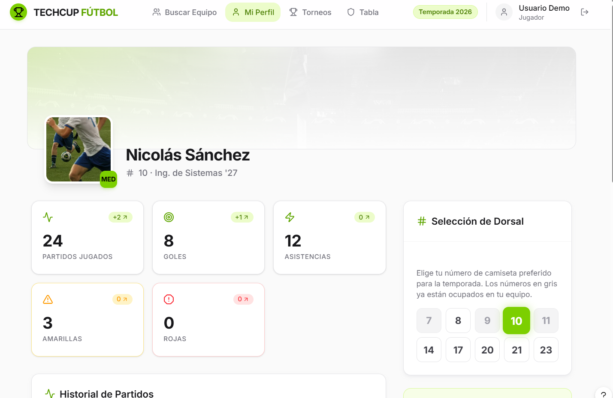
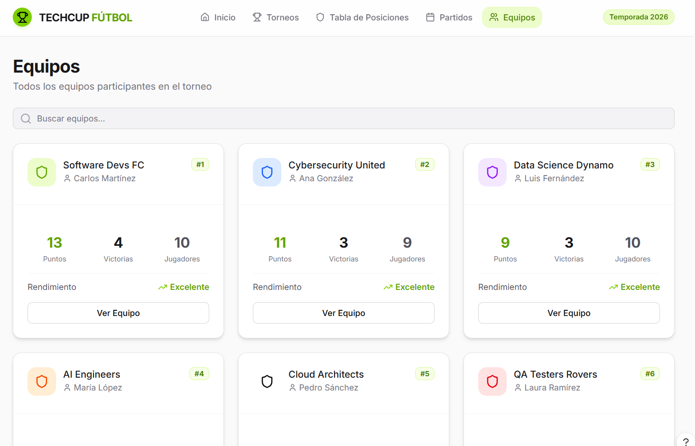
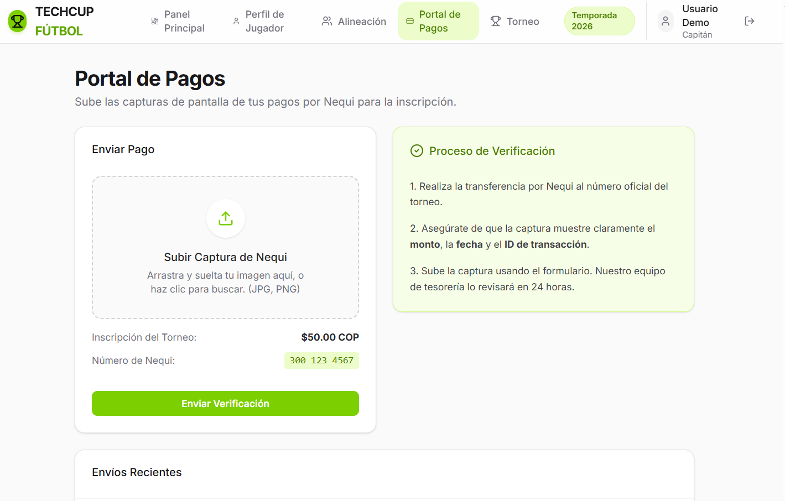
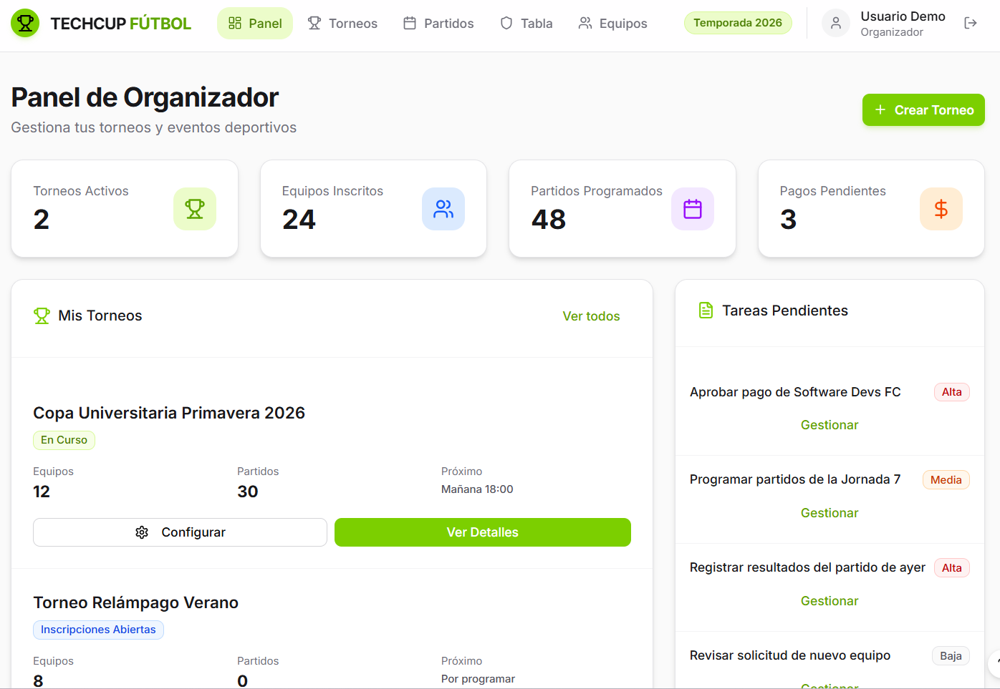
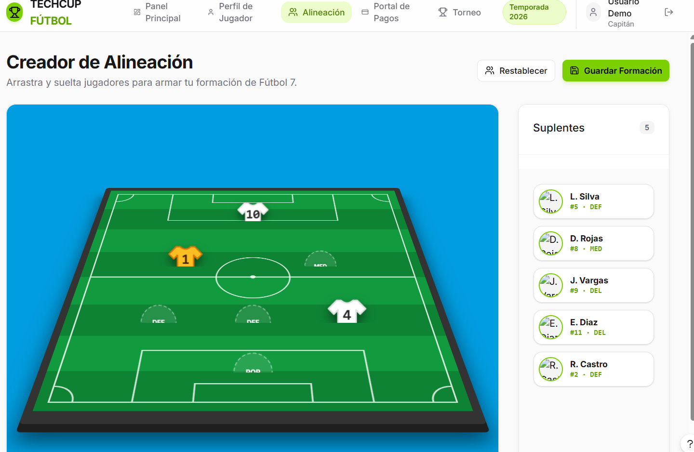
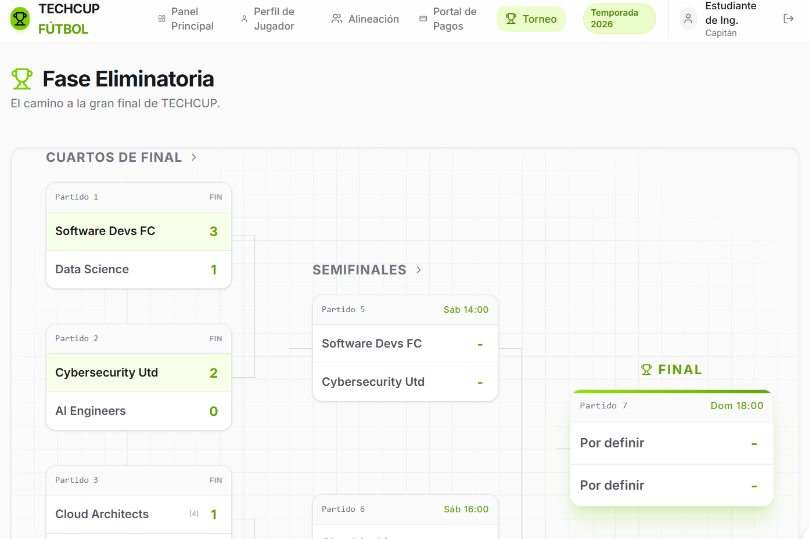
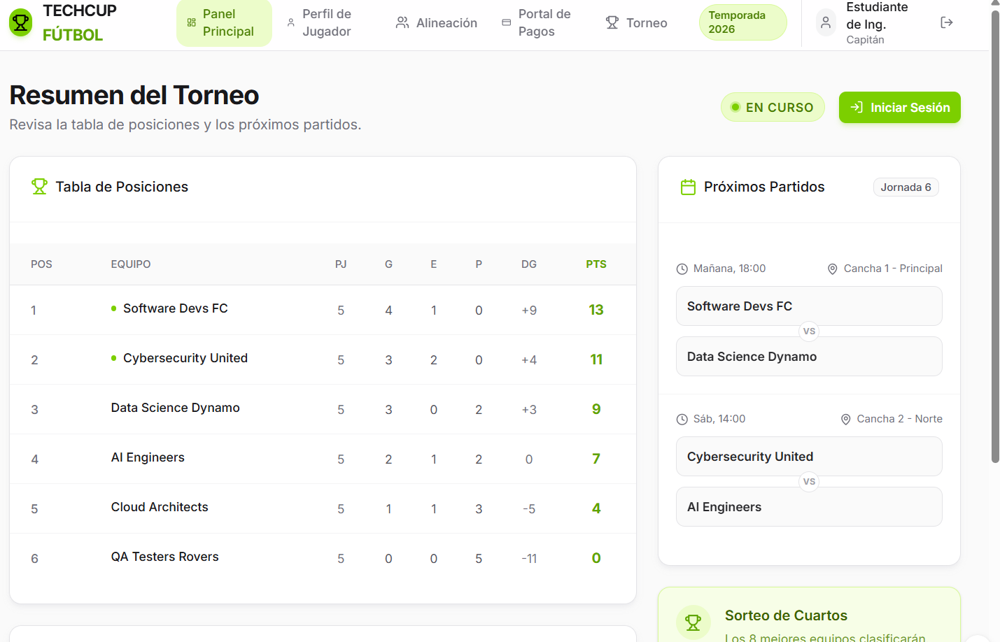

# Zeus-Codensa Front-End (TECHCUP FÚTBOL)

Plataforma digital para la gestión del torneo semestral de fútbol de la Escuela Colombiana de Ingeniería (ECI).

## 1. Participantes del Proyecto
* Fabian (Líder Técnico)
* Nicolas (Ingeniero de Back - Arquitectura)
* Felipe (Ingeniero de Back - DevOps)
* Majo (Ingeniera de Front)
* Stiven (Ingeniero de Front + QA)

## 2. Contexto del Proyecto
Los programas de Ingeniería de Sistemas, Inteligencia Artificial, Ciberseguridad y Estadística realizan cada semestre un torneo interno de fútbol. La organización actual se basa en canales manuales (mensajería, formularios y hojas de cálculo), lo cual genera retrasos, errores y baja trazabilidad.

**TECHCUP FÚTBOL** centraliza en una sola aplicación web el registro de participantes, la gestión de equipos, la validación de pagos, la programación de partidos y la visualización de resultados, tabla de posiciones, llaves y estadísticas; transformando el torneo en una experiencia ágil y de alto rendimiento.

## 3. Logotipo y Manual de Identidad Visual
*Eslogan: "Tu torneo, tu estadio, tus reglas."*

El diseño se apoya en un **Light Mode**, usando el **Verde Lima Vibrante (#84CC16)** como acento principal de energía, complementado por tipografía geométrica y luminosa de la familia **Inter**. Todo el lenguaje visual, incluyendo iconografía y esquemas de botones redondeados, está detallado en nuestro manual oficial.

📥 [Descargar/Ver Manual de Identidad Visual completo (PDF/Markdown)](./docs/design/manual_identidad.md)

*(Revisar la carpeta local `docs/design` para ver los logotipos y especificaciones completas de color)*

## 4. Mockups del Sistema
El diseño interactivo y la propuesta de pantallas (interfaces para organizador, capitán y jugador) se pueden navegar en el enlace oficial:

🔗 **Link de Figma:** [https://tag-skit-64046987.figma.site](https://tag-skit-64046987.figma.site)
**Link de jira:** https://mail-team-q7lj9.atlassian.net/jira/software/projects/PZC/boards/168/backlog?epics=visible&atlOrigin=eyJpIjoiZTgwNjhhNTQ5YzVkNDRiZDgyNjg4YzQ3YzlkYzc5OGQiLCJwIjoiaiJ9 
## 5. Módulos de la Aplicación Web

### 1. Módulo de autenticación y registro
Permite el registro e inicio de sesión de estudiantes, graduados, profesores, personal administrativo y familiares, aplicando reglas por tipo de correo y rol.

### 2. Módulo de perfil de jugador
Permite crear y actualizar el perfil deportivo del participante: posición, dorsal, fotografía y disponibilidad para equipos.

### 3. Módulo de equipos y capitanes
Permite crear equipos, definir nombre, escudo y colores, invitar jugadores y validar reglas de conformación del equipo.

### 4. Módulo de inscripción y pagos
Permite cargar comprobantes de pago, revisar evidencias y cambiar estado de inscripción (Pendiente, En revisión, Aprobado, Rechazado).

### 5. Módulo de configuración del torneo
Permite al organizador definir reglamento, fechas importantes, cierre de inscripciones, canchas, sanciones y calendario general.

### 6. Módulo de alineaciones
Permite a cada capitán seleccionar titulares y reservas, elegir formación y ubicar jugadores visualmente para cada partido.

### 7. Módulo de partidos y resultados
Permite registrar marcador, goleadores y tarjetas, así como consultar datos operativos para árbitros y organizadores.

### 8. Módulo de tabla y llaves eliminatorias
Calcula automáticamente la tabla de posiciones y genera las fases eliminatorias (cuartos, semifinal y final).

### 9. Módulo de estadísticas
Muestra máximos goleadores, historial de partidos y resultados por equipo para consulta pública del torneo.

