# Manual de Identidad de Marca y UI - TECHCUP FÚTBOL

## 1. Introducción y Filosofía de Marca

La construcción de la marca **TECHCUP FÚTBOL** trasciende el ámbito estético; representa un ecosistema diseñado para dignificar y profesionalizar la gestión de torneos deportivos a nivel amateur y semi-profesional. 

Nuestro **elemento central** es la convergencia entre la pasión visceral por el deporte y la frialdad analítica de la tecnología de datos. Actuamos como el puente que transforma la organización caótica de un torneo de fin de semana en una experiencia de alto rendimiento y primer nivel tanto para organizadores como para jugadores.

### Valores Fundamentales:
- **Profesionalismo y Rigurosidad:** Dotamos de credibilidad a la gestión de datos deportivos, ofreciendo herramientas robustas y exactas.
- **Transparencia Inmediata:** Creemos en la democratización de la información. Resultados, estadísticas y sanciones siempre disponibles y en tiempo real.
- **Dinamismo Competitivo:** Reflejamos la energía del campo de juego en cada interacción de la plataforma, manteniendo vivo el espíritu competitivo sano.
- **Vanguardia Práctica:** La innovación tecnológica tiene sentido únicamente cuando resuelve problemas reales. Nuestra tecnología no es un adorno, es utilidad pura.

## 2. Nombre y Eslogan

- **Nombre de la Marca:** TECHCUP FÚTBOL
- **Eslogan Propuesto:** *"Tu torneo, tu estadio, tus reglas."* 

**Logo Principal (Imagotipo):** 
Uso primario en la aplicación, encabezados, documentos oficiales y material promocional de alto impacto. Debe ser la primera opción siempre que el espacio lo permita.

**Isologo (Símbolo sin texto):** 
Uso destinado para avatares, favicons, o en espacios cuadrados reducidos donde la lectura del texto de la marca sea imposible.

**Isologo Horizontal:** 
Uso óptimo para barras de navegación superiores (*Topbars* o *Sidebars* colapsados) y banners donde el espacio vertical sea extremadamente limitado.

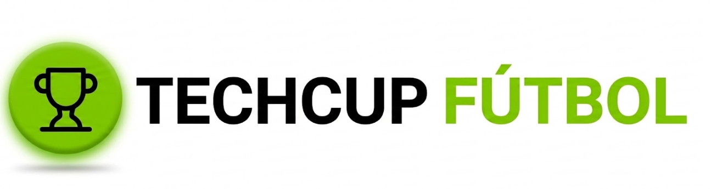

**Isologo Monocromático:** 
Uso restringido para fondos fotográficos complejos, marcas de agua corporativas, material impreso a una tinta o en estados neutros/inactivos de la UI.

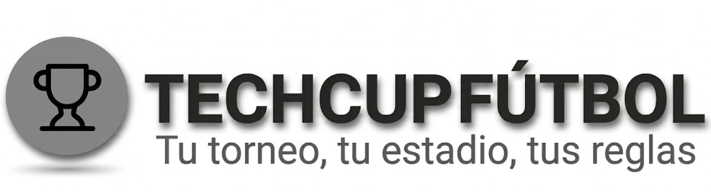

**Símbolo en Contorno (Wireframe/Outline):** 
Uso en detalles estéticos de fondo (marcas de agua gigantes opacas deportivas), cargadores (*loaders*), o en aplicaciones de bordado y serigrafía simple.

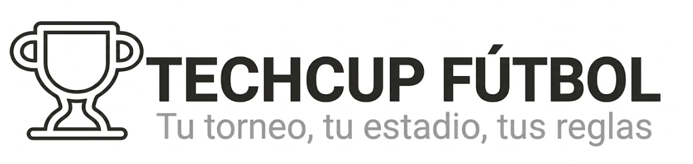

## 3. Público Objetivo

Nuestra plataforma está diseñada y optimizada para dos perfiles principales:

1. **Organizadores de Torneos (Administradores):**
   - **Perfil:** Personas o entidades dedicadas a gestionar ligas de fútbol 5, fútbol 7, y fútbol 11. Suelen lidiar con hojas de cálculo desactualizadas, problemas de cobros y desorganización de estadísticas.
   - **Necesidad Básica:** Eficiencia, gestión automatizada, control financiero, y un medio para proyectar profesionalismo hacia los equipos participantes.

2. **Jugadores, Capitanes y Aficionados (Usuarios Finales):**
   - **Perfil:** Deportistas amateur, entusiastas del fútbol que participan activamente en ligas competitivas. Les interesa revisar estadísticas personales (goleadores), consultar posiciones, horarios de partidos e incidencias disciplinarias (tarjetas).
   - **Necesidad Básica:** Experiencia fluida orientada a un diseño web responsivo, acceso inmediato a datos estadísticos de su rendimiento y el de sus rivales, todo desde un entorno visual atractivo que los haga sentir en una liga profesional.

## 4. Paleta de Colores

Nuestra arquitectura de color ha sido diseñada para garantizar una accesibilidad y legibilidad óptimas a través de un espacio luminoso (*Light Mode*), contrastado con una vitalidad deportiva mediante un verde lima/manzana de muy alta energía.

- **Verde Principal (Acento y Energía): `#84CC16` (Verde Lima Vibrante)**
  - El núcleo visual de la marca y foco de atención. Evoca el césped de día, modernidad y actividad constante.
  - *Uso:* Logotipo principal, botones de acción primarios (CTA: "Iniciar Sesión"), resaltes de estadísticas fundamentales (ej. Puntos en la tabla), estados afirmativos ("EN CURSO").

  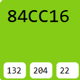

- **Verde Secundario (Apoyo Interactivo y Pastel): `#ECFCCB` (Verde Claro Suave)**
  - Tono pastel derivado del principal para acompañamiento sutil, generando volumen sin quitar protagonismo a los textos.
  - *Uso:* Fondos de botones de navegación destacados (Ej. "Panel Principal"), etiquetas de temporada o contenedores promocionales (Ej. "Sorteo de Cuartos").

  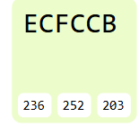
  
- **Superficies y Fondos Objeto (Estructura y Base): `#FFFFFF`, `#F8FAFC`, `#E5E7EB`**
  - Generan el contraste negativo necesario para la legibilidad perfecta de un dashboard denso en datos.
  - *Uso:* El fondo principal de la aplicación es un gris muy claro (`#F8FAFC`), mientras que las tarjetas o contenedores se elevan visualmente usando blanco puro (`#FFFFFF`). Los bordes y líneas divisorias de las tablas son grises tenues (`#E5E7EB`).

 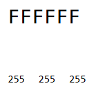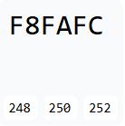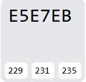

- **Colores de Semántica y Texto (Lectura Crítica): `#111827`, `#6B7280`, `#EF4444`**
  - Los textos principales (títulos y posiciones) se leen en un gris oscuro muy cercano al negro (`#111827` o `#1F2937`), sustituyendo al negro puro por confort visual.
  - Los metadatos (fechas, subtítulos inactivos y cabeceras de tabla) emplean un gris medio (`#6B7280`).
  - El color rojo semántico (`#EF4444`) se mantiene reservado estrictamente para advertencias o sanciones (Tarjetas Rojas).
 
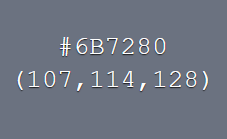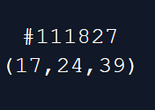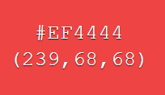

## 5. Tipografía

La voz visual de la marca es limpia, geométrica y luminosa, garantizando legibilidad perfecta en interfaces densas y con múltiples datos estadísticos.

- **Familia Tipográfica Principal:** **`Inter`**.
  - Elegida como la única tipografía de la interfaz por su diseño *Neo-Grotesque* sin serifas, optimizada específicamente para pantallas, lectura de datos numéricos densos y máxima legibilidad (ideal para tablas de posiciones y marcadores temporales).
- **Estructura de Pesos:**
  - **Encabezados (Títulos de página, Nombres de Equipos):** Pesos *Bold* (700) para un impacto visual directo y jerarquía clara.
  - **Puntuaciones y Estadísticas Numéricas:** Uso frecuente de *Semi-Bold* (600) para que las métricas relevantes llamen la atención inmediatamente.
  - **Descripciones Tabulares y Textos Comunes:** Grosores *Regular* (400) favoreciendo una lectura que evite la fatiga ocular y simplifique visualmente pantallas muy cargadas.

*Muestra del espécimen tipográfico principal:*

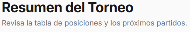

*Abecedario y variaciones de grosores de la fuente:*

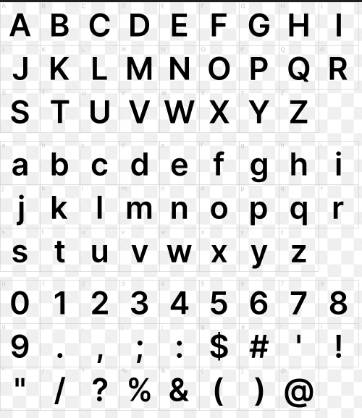

## 6. Elementos Visuales del Diseño (Guía de Estilo UI)

### 6.1. Botones (Call to Action)
- **Botón Primario ("El Disparo"):** Fondos enteramente de Verde Principal (`#84CC16`), texto en blanco puro u oscuro dependiendo del contraste, bordes con un esquema fuertemente redondeado tipo píldora (*pill-shape*, `border-radius: 9999px`). Utilizado solo para las acciones más críticas de la pantalla (ej. "Iniciar Sesión", "Enviar Verificación").

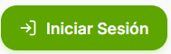

- **Botón Secundario ("El Pase"):** Con fondo casi transparente o blanco y borde delineado sutil en gris o verde claro. Utilizados como acciones complementarias (Cancelar, Editar Perfil).

### 6.2. Iconografía
- **Estética Vectorial Lineal y Amigable:** Iconos limpios, minimalistas, de trazo continuo. Orientados hacia un *Light Mode*, los íconos decorativos en tarjetas de rendimiento (P. ej. *Goles*, *Asistencias*, *Partidos Jugados*) emplean tonos Verde Principal y Secundario para mantener la identidad visual del deporte.
- **Semiótica Deportiva Contemporánea:** Íconos tácticos para estrategia, cronómetros y trofeos que lucen tan sofisticados e intuitivos como la interfaz de un videojuego deportivo moderno (Ej. EA FC). La iconografía del menú de navegación interactivo parte de un tono gris inactivo hacia un verde vibrante cuando es el módulo activo.

### 6.3. Indicadores (Badges / Pills)
- **Alertas Estructurales:** Formas ovaladas compactas (*pill-shape*) con un indicador luminoso (punto de estatus). Emplean un fondo Verde Pastel (`#ECFCCB`) y texto en Verde Oscuro destacando estados como "EN CURSO" o detalles de "Temporada 2026".

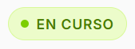

- **Alertas Disciplinarias (Tarjetas):** Las amonestaciones evolucionan; en lugar de simples cuadrados, emplean íconos delimitados por color: Triángulos de advertencia naranjas (`#F59E0B`) para amarillas, e Iconos de peligro rojos (`#EF4444`) para las tarjetas rojas, enmarcados sobre tarjetas de fondos extremadamente sutiles (*Light Red/Orange*).

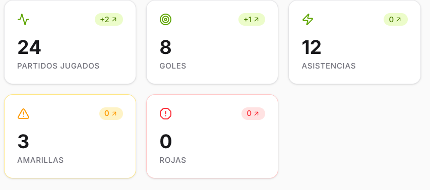

### 6.4. Formularios y Entradas (Inputs)
- Las cajas de introducción de texto, subida de vouchers (Portal de Pagos) o selección de opciones (Dorsales) basan su contraste en un fondo claro (`#FFFFFF` o `#F8FAFC`). Emplean un borde gris muy tenue que reacciona (*Focus State* o Estado Activo) con un perímetro más sólido o relleno (ej. Cuadros de dorsales seleccionados rellenados en `#84CC16`) para destacar fuertemente la interacción activa del usuario.

